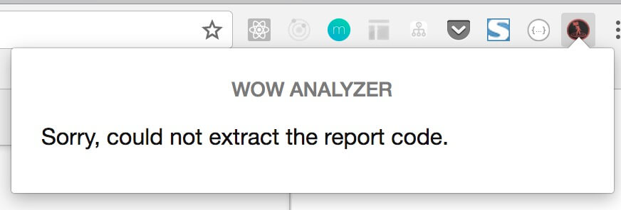

## How to use this extension

### Install from chrome

I have already publish this extension in chrome's web store. So you can go to the [download page](https://chrome.google.com/webstore/detail/wow-analyzer/dnmgmiogknpdbgfgmolloddhiijkpekd) and install it.

### Active the extension

After installed the extension, you will see an icon in your toolbar.

Press the icon then you will probably see a popup showing this:

That's the expected result because you have not opened a WCL report page.

When you open a WCL report page, for example [this one](https://www.warcraftlogs.com/reports/4hJvrLn7fTwq18t9#fight=8), and press the extension icon again, you will have this in the popup:

.

Pressing the analyze button in the popup and the extension will navigate to the WoWAnalyzer report page.
