# Statistic Boxes

Statistic boxes show off module details independently of suggestions. Statistic boxes are coded into their related module Javascript files, typically as the last thing in the module code. 

**General topics**
- [Box layout & order](#box-layout--order)
- [Imports used](#imports-used)
- [Basic statistic box](#statisticbox)
  - [Code skeleton and anatomy](#code-skeleton) 

**Statistic box styles**
- Basic (above)
- [Multiple icons in a basic box](#multiple-listing)
- [Downtime's styled footer bar](#downtimes-styled-footer-bar)
- [Small](#smallstatisticbox)
- [List (Netherlight Crucible style)](#statisticslistbox)
- [Expandable](#expandablestatisticbox)
- [Click to load](#lazyloadstatisticbox)

## Box layout & order

The statistic boxes are laid out in rows from left to right for three columns at most, then top to bottom as long as there are boxes. Typically one of two STATISTIC_ORDER values are used in spec statistic boxes. `CORE` is for base spec abilities, resources, and core spec procs; `OPTIONAL` is used for sometimes-things like talents or minor constants like relics and artifact traits. In detail, the [STATISTIC_ORDER](../src/Main/STATISTIC_ORDER.js) uses this ordering, first > last: `CORE` > `DEFAULT` > `OPTIONAL` > `UNIMPORTANT`.

**NOTE**: Display box height will disrupt the order layout, so sometimes it's confusing and awkward to get an exact box order. If you want certain modules to group together in the box display grid, consider using a combo box instead of many default boxes, or perhaps grouping similarly sized boxes together. 

Fudge edition: See [Holy Paladin's CastBehavior module](../src/Parser/Paladin/Holy/Modules/PaladinCore/CastBehavior.js). If you adjust browser window size on a Holy Paladin parse, you'll notice that *Infusion of Light usage* and *Fillers* always land in the same column together, with *Fillers* always on the bottom. You can fudge stat boxes together into the same column by constructing their stat boxes together in the same module. **However** it's highly recommended you do this only as a last resort, since WoWAnalyzer is flexible to both the player & how the spec will perform over patches. Think about your box selection and organization first.

## Imports used

```javascript
import React from 'react';

// for pie charts
import { Doughnut as DoughnutChart } from 'react-chartjs-2';

// icons
import SpellIcon from 'common/SpellIcon';
import Icon from 'common/Icon';

// spell links for text
import SpellLink from 'common/SpellLink';

// text/number formatting
// for more formats, see /src/common/format.js 
import { formatPercentage } from 'common/format';
import { formatThousands } from 'common/format'; // formats into 1,000
import { formatNumber } from 'common/format'; // formats into 1k

// statistic boxes + order
import StatisticBox, { STATISTIC_ORDER } from 'Main/StatisticBox';
import SmallStatisticBox, { STATISTIC_ORDER }  from 'Main/SmallStatisticBox';
import StatisticsListBox, { STATISTIC_ORDER } from 'Main/StatisticsListBox';
import LazyLoadStatisticBox, { STATISTIC_ORDER } from 'Main/LazyLoadStatisticBox';

import { STATISTIC_ORDER } from 'Main/StatisticBox'; // Expandable doesn't have STATISTIC_ORDER in it
import ExpandableStatisticBox from 'Main/ExpandableStatisticBox';
```

## StatisticBox

StatisticBox is the default and basic statistic box that you will see in the [getting started module documentation](../docs/a-new-module.md). Here's an example of the minimum box you can make.


```javascript
// Simple DoT uptime box (Agony Uptime)

  statistic() {
    const agonyUptime = this.enemies.getBuffUptime(SPELLS.AGONY.id) / this.owner.fightDuration;
    return (
      <StatisticBox
        icon={<SpellIcon id={SPELLS.AGONY.id} />}
        value={`${formatPercentage(agonyUptime)} %`}
        label="Agony uptime"
      />
    );
  }

  statisticOrder = STATISTIC_ORDER.CORE(3);
```

### Code skeleton

```javascript
statistic() {
  // variables or constants if needed

  return (
    <StatisticBox
      icon={} // left-aligned, center-aligned icon
      value={` `} // big text / main content of the stat box
      label={} // small text
      tooltip={} // tooltip on label text
      footer={} // options for a Downtime bar style
    />
  );
}

statisticOrder = STATISTIC_ORDER.CORE(###);
``` 

### Icon

For a Wowhead tooltip on the icon mouseover, use a `<SpellIcon />` for the icon. The id should  be referencing one of the spells already in the WoWAnalyzer SPELLS folder. Add your spell to your class if it isn't there.
- `icon={<SpellIcon id={SPELLS.AGONY.id} />}`

For a plain icon, use an `<Icon />` with the icon name. 
- `icon={<Icon icon="ability_hunter_snipershot" />}`

If you want to find the icon name for a particular icon, follow these steps:
1. Find your spell or item on Wowhead. For example, [Enchant Ring - Binding of Haste](https://www.wowhead.com/item=128542/enchant-ring-binding-of-haste).
2. Click the spell's/item's icon on Wowhead, next to the tooltip.
3. A box will come up, showing the icon's name.

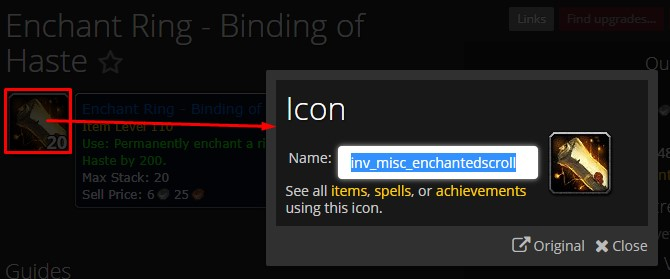

For a custom icon, include an import of your icon image file in the top of the module, then reference it in a plain ``.
- `icon={}` from the [Holy Paladin - Mastery Effectiveness](../src/Parser/Paladin/Holy/Modules/Features/MasteryEffectiveness.js) stat box.
- note that MasteryRadiusImage is in `/public/img` not in the `Paladin/Holy` folder.
  
### Value

To get a value into a percentage, use formatPercentage (import module). It's common practice to do calculations before and store with a variable/constant name, then reference the variable/constant name here.
- ```value={`${formatPercentage(agonyUptime)} %`}```
- ```value={`${((this.heals / totalCastsIncludingDp) || 0).toFixed(2)} players`}```
- ```value={`${formatNumber(this.hps)} HPS`}```

### Label

For basic text with no tooltip, just use a basic double-quote string.
- `label="Agony uptime"`

For a basic tooltip via label: 
```javascript
label={(
  <dfn data-tip="This is the effective healing contributed by the Eveloping Mists buff."> // tooltip
    Healing Contributed // label
  </dfn>
)}
``` 

For a longer tooltip via label --> see [Mistweaver Monk - Mana Tea](../src/Parser/Monk/Mistweaver/Modules/Talents/ManaTea.js) talent module stat box.

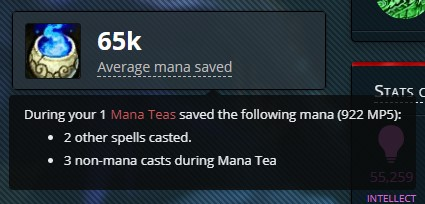

### Tooltip

For a basic tooltip:
```
tooltip="Tooltip text here."
```

For longer tooltip variations, see [Holy Paladin - Beacon of Faith healing](../src/Parser/Paladin/Holy/Modules/PaladinCore/BeaconHealing.js) or [Holy Paladin - Holy Avenger](../src/Parser/Paladin/Holy/Modules/Talents/HolyAvenger.js) talent module stat boxes.

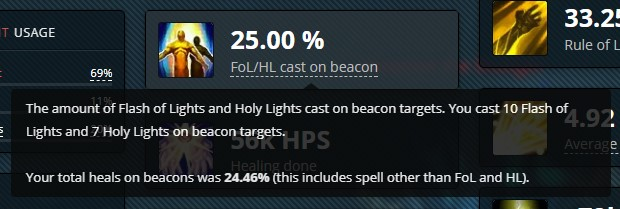
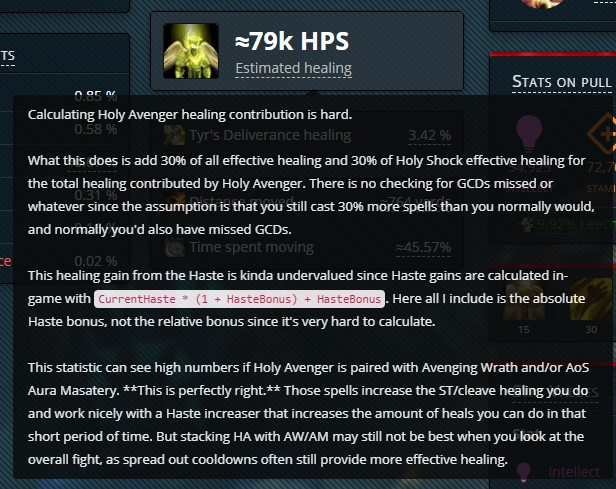

### Footer

This footer bar is usually seen as part of the damage taken, healing done, or downtime module boxes. However, you can also adapt it to a display module -- see [the styled footer bar](#downtimes-styled-footer-bar) box variation section below.

---

## Multiple listing

You can add multiple icons or text rows within a StatisticBox, if you want to show different parts of a module. These are built with a `<span>` element with smaller-styled icons within the `value={}`. 
- **Horizontal**: Two or three icons could fit on one line before visually breaking the box. 
- **Vertical**: This grouping works better visually if the display contains a lot of text.

```javascript
<span>
  // first variable value + regular icon
  {this.var1}{'  '}
  <SpellIcon 
    id={}
    style={{
      height: '1.3em',
      marginTop: '-.1em',
    }}
  />
  {'  '} // spacer

  // use a <br /> in between value-icon sets if you want a vertical listing instead of horizontal

  // second variable value + greyed-out icon
  {this.badCrowsCasts + this.shouldHaveSavedCrows}{'  '}
  <SpellIcon
    id={SPELLS.A_MURDER_OF_CROWS_TALENT_SHARED.id}
    style={{
      height: '1.3em',
      marginTop: '-.1em',
      filter: 'grayscale(100%)',
    }}
  />
</span>
```

### Horizontal icon arrangement

The example below is [Beast Mastery Hunter - A Murder of Crows](../src/Parser/Hunter/BeastMastery/Modules/Talents/AMurderOfCrows.js), but a lot of the Beast Mastery and Marksmanship Hunter modules are done this way.

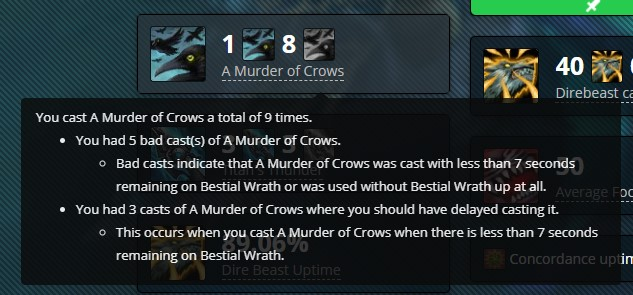

### Vertical icon arrangement

For a simple listing, see [Frost Mage - Winter's Chill](../src/Parser/Mage/Frost/Modules/Features/WintersChill.js). For a `.map()` array of multiple similar elements, see [Elemental Shaman - Overload](../src/Parser/Shaman/Elemental/Modules/Features/Overload.js).

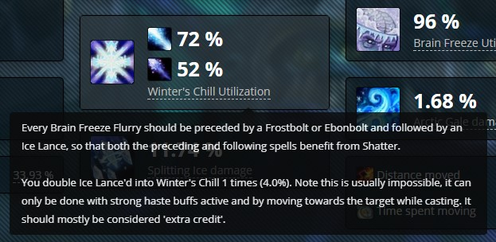
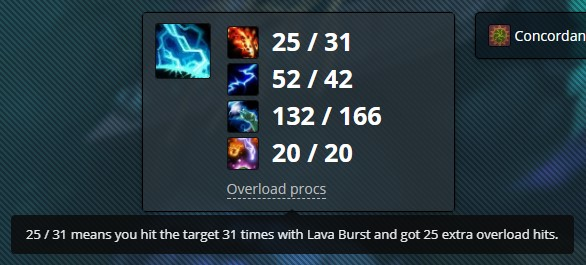

## Downtime's styled footer bar

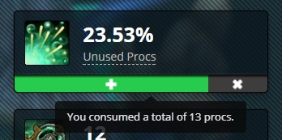

```javascript
// Mistweaver Monk - Uplifting Trance box
<StatisticBox
  icon={<SpellIcon id={SPELLS.UPLIFTING_TRANCE_BUFF.id} />}
  value={`${formatPercentage(unusedUTProcsPerc)}%`}
  label={(
    <dfn data-tip={`${this.nonUTVivify} of your vivify's were used without an uplifting trance procs.`}>
      Unused Procs
    </dfn>
  )}
  footer={(
    <div className="statistic-bar">
      <div
        className="stat-healing-bg"
        style={{ width: `${this.consumedUTProc / this.UTProcsTotal * 100}%` }}
        data-tip={`You consumed a total of ${this.consumedUTProc} procs.`}
      >
        
      </div>
      
      <div
        className="remainder stat-overhealing-bg"
        data-tip={`You missed a total of ${unusedUTProc} procs.`}
      >
        
      </div>
    </div>
  )}
  footerStyle={{ overflow: 'hidden' }}
/>
```

Look at the [DamageTaken module](../src/Parser/Core/Modules/DamageTaken.js) for a `.map()`` version of many sections in the footer bar.

The last bar color is always coded `className="remainder {bg color}"` so that the bar fills the remainder in with that background color. If the bar colors were switched in the Uplifting Trance example, the first would be `className="stat-overhealing-bg"` and the second would be `className="remainder stat-healing-bg"`.

The white images on top of the colored bars come from `/public/img`. 

The bar colors come from the className value, and are found deep in [/src/Main/App.css](../src/Main/App.css).
- `"{class}-bg"` colors: lines 667-678.
- `"stat-{something}-bg"` colors: lines 713-736.
- `"spell-school-{type}-bg"` colors: lines 739-764.

## SmallStatisticBox

This is the stat box that contains a one-liner of text. These boxes typically use the `UNIMPORTANT` statistic order. It's quite similar to the default StatisticBox, with minor differences:
- the `icon` is smaller
- the `value` is the right text
- the `label` is the left text
- the `tooltip` appears on the value, not on the label

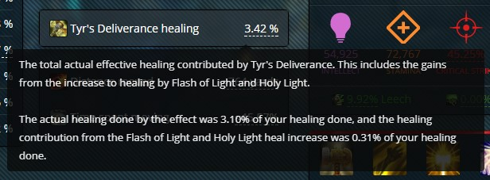

```javascript
// Holy Paladin - Tyr's Deliverance

statistic() {
  const tyrsDeliveranceHealHealingPercentage = this.owner.getPercentageOfTotalHealingDone(this.healHealing);
  const tyrsDeliveranceBuffFoLHLHealingPercentage = this.owner.getPercentageOfTotalHealingDone(this.buffFoLHLHealing);
  const tyrsDeliverancePercentage = tyrsDeliveranceHealHealingPercentage + tyrsDeliveranceBuffFoLHLHealingPercentage;

  return (
    <SmallStatisticBox
      icon={<SpellIcon id={SPELLS.TYRS_DELIVERANCE_CAST.id} />}
      value={`${formatPercentage(tyrsDeliverancePercentage)} %`}
      label="Tyr's Deliverance healing"
      tooltip={`The total actual effective healing contributed by Tyr's Deliverance. This includes the gains from the increase to healing by Flash of Light and Holy Light.<br /><br />The actual healing done by the effect was ${formatPercentage(tyrsDeliveranceHealHealingPercentage)}% of your healing done, and the healing contribution from the Flash of Light and Holy Light heal increase was ${formatPercentage(tyrsDeliveranceBuffFoLHLHealingPercentage)}% of your healing done.`}
    />
  );
}
statisticOrder = STATISTIC_ORDER.UNIMPORTANT();
```

## StatisticsListBox

**Note!** Statistic**s**ListBox. Every other box is singular StatisticBox.

This is the statistic box that looks like a list of SmallStatisticBoxes one-liners but in one box. The general example is Netherlight Crucible traits and the Relic traits in some class-specs. However, this box type isn't restricted to artifact traits; in fact, you can use it to make pie chart statistics.

List boxes have `title` instead of a label, a `tooltip`, and then their list items as `subStatistic()`s if in different files or as styled within the `<StatisticsListBox>` tags if all in one module.

### Single-file list box

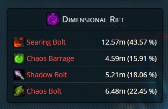

For example, see [Destruction Warlock - Dimensional Rift](../src/Parser/Warlock/Destruction/Modules/Features/DimensionalRift.js). The differences from the Relic Traits list box is that everything is constructed in the single `statistic()` using a `.map()` containing the list item styling.

### Relic traits

[Netherlight Crucible](../src/Parser/Core/Modules/NetherlightCrucibleTraits) is a core module and doesn't need to be constructed by every spec. Netherlight Crucible and relic traits are constructed similarly. Have a `Traits` folder with one master `RelicTraits.js` and one `ArtifactTraitName.js` for every relic trait you wish to track.

```javascript
import React from 'react';

import StatisticsListBox, { STATISTIC_ORDER } from 'Main/StatisticsListBox';

import Analyzer from 'Parser/Core/Analyzer';

// import ArtifactTraitName from './ArtifactTraitName';
//... for each artifact trait module

class RelicTraits extends Analyzer {
  static dependencies = {
    artifactTraitName: ArtifactTraitName,
    //... for each artifact trait module
  };

  statistic() {
    return (
      <StatisticsListBox
        title="Relic traits"
        tooltip=""
      >
        {this.artifactTraitName.subStatistic()}
        //...for each artifact trait to be displayed
      </StatisticsListBox>
    );
  }
  statisticOrder = STATISTIC_ORDER.OPTIONAL(1000);
}

export default RelicTraits;
```

In the specific artifact trait module, after you have your calculations, use a `subStatistic()` instead of a `statistic()`.

```javascript
subStatistic() {
  return (
    <div className="flex">
      <div className="flex-main">
        <SpellLink id={} />
      </div>
      <div className="flex-sub text-right">
        {formatPercentage(this.valueToDisplay)} %
      </div>
    </div>
  );
}
```

### Pie charts

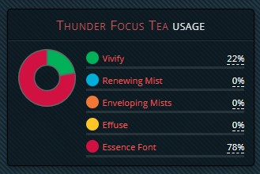 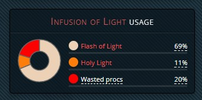 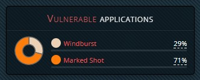 

Pie charts have a few parts for thir modules in addition to events and calculations for the module. 

The `legend(items, total)` & `chart(items)` blocks are largely the same in every case. `CHART_SIZE` is a constant declared at the top of the module with the imports. Infusion of Light & Thunder Focus Tea use `const CHART_SIZE = 75;` while Vulnerable Applications uses `const CHART_SIZE = 50;`, for reference.

```javascript
legend(items, total) {
const numItems = items.length;
return items.map(({ color, label, tooltip, value, spellId }, index) => {
  label = tooltip ? (
    <dfn data-tip={tooltip}>{label}</dfn>
  ) : label;
  label = spellId ? (
    <SpellLink id={spellId}>{label}</SpellLink>
  ) : label;
  return (
    <div
      className="flex"
      style={{
        borderBottom: '3px solid rgba(255,255,255,0.1)',
        marginBottom: ((numItems - 1) === index) ? 0 : 5,
      }}
      key={index}
    >
      <div className="flex-sub">
        <div
          style={{
            display: 'inline-block',
            background: color,
            borderRadius: '50%',
            width: 16,
            height: 16,
            marginBottom: -3,
          }}
        />
      </div>
      <div className="flex-main" style={{ paddingLeft: 5 }}>
        {label}
      </div>
      <div className="flex-sub">
        <dfn data-tip={value}>
          {formatPercentage(value / total, 0)}%
        </dfn>
      </div>
    </div>
  );
});

chart(items) {
  return (
    <DoughnutChart
      data={{
        datasets: [{
          data: items.map(item => item.value),
          backgroundColor: items.map(item => item.color),
          borderColor: '#666',
          borderWidth: 1.5,
        }],
        labels: items.map(item => item.label),
      }}
      options={{
        legend: {
          display: false,
        },
        tooltips: {
          bodyFontSize: 8,
        },
        cutoutPercentage: 45,
        animation: false,
        responsive: false,
      }}
      width={CHART_SIZE}
      height={CHART_SIZE}
    />
  );
}
```

After figuring out through normal module events and calculations what you want to display, arrange your items within your specific module's chart.

```javascript
moduleDisplayNameChart() {
  const itemName = this.itemCalcValue;
  //...for every item to be listed
  const totalModule = this.howeverYouDecideTheTotalValue;

  const items = [
    // for each item listed
    {
      color: '#hexcode',
      label: 'List item name',
      spellId: SPELLS.SPELL.id,
      value: itemName,
    },
  ];

  return(
    <div className="flex">
      <div className="flex-sub" style={{ paddingRight: 12 }}>
        {this.chart(items)}
      </div>
      <div className="flex-main" style={{ fontSize: '80%', paddingTop: 3 }}>
        {this.legend(items, totalModule)} 
      </div>
    </div>
  ); 
}
```

Finally, the `statistic()` looks like this:

```javascript
statistic() {
  return (
    <div className="col-lg-4 col-sm-6 col-xs-12">
      <div className="row">
        <StatisticsListBox
          title={<span><SpellLink id={SPELLS.SPELL.id}>SpellName</SpellLink> usage</span>}
          containerProps={{ className: 'col-xs-12' }}
        >
          {this.moduleDisplayNameChart()}
        </StatisticsListBox>
      </div>
    </div>
  );
}
statisticOrder = STATISTIC_ORDER.CORE(10);
```

For full code in action, see:
- [Marksmanship Hunter - Vulnerable Applications](../src/Parser/Hunter/Marksmanship/Modules/Features/VulnerableApplications.js)
- [Mistweaver Monk - Thunder Focus Tea](../src/Parser/Monk/Mistweaver/Modules/Spells/ThunderFocusTea.js)
- [Holy Paladin - Infusion of Light + Fillers](/src/Parser/Paladin/Holy/Modules/PaladinCore/CastBehavior.js)

## ExpandableStatisticBox

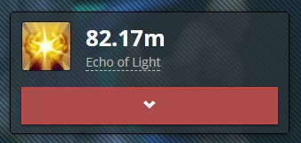

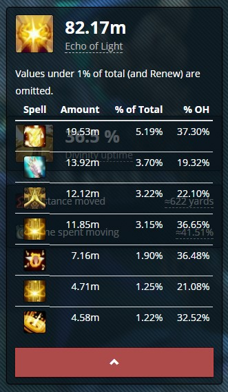 

Some statistic boxes have a big red button to expand. Do note that the expansion doesn't shove the rest of the column's boxes down the page, but overlaps them. The box has a tinted background, but depending on the box below, the overlapping graphics may or may not cause reading issues.

Usually these are done for hiding otherwise long tables. This is the general code skeleton, where the table and all relevant HTML goes in between the `<ExpandableStatisticBox>` tags.

```javascript
statistic() {
  // any const needed

  return(
    <ExpandableStatisticBox
      icon={}
      value={``}
      label=""
      tooltip={`<html if wanted>`}
    >
      <div>
      Display text
      </div>
      <table className="table table-condensed">
        <thead>
          <tr>
            <th></th>
          <tr>
        </thead>
        <tbody>
          // table body with a .map()
        </tbody>
    </ExpandableStatisticBox>
  );
}
statisticORDER = STATISTIC_ORDER.OPTIONAL(10);
```

For full code, check out:
- [Restoration Druid - Flourish](../src/Parser/Druid/Restoration/Modules/Talents/Flourish.js)
- [Discipline Priest - Evangelism](../src/Parser/Priest/Discipline/Modules/Spells/Evangelism.js)
- [Holy Priest - Mastery Breakdown](../src/Parser/Priest/Holy/Modules/PriestCore/MasteryBreakdown.js)

## LazyLoadStatisticBox

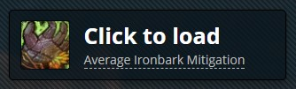

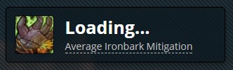

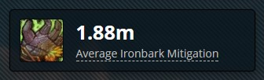

If you need a statistic to wait to load until asked for, you can do it with a LazyLoad box. When you click the button, the statistic loads, instead of the normal loading with the page.

There's a load part and an otherwise almost normal stat box configuration.

```javascript
load() {
  return fetchWcl(`report/tables/damage-taken/${this.owner.report.code}`, {
    start: this.owner.fight.start_time,
    end: this.owner.fight.end_time,
    filter: `()`,
      // WCL query filter
      // WCL guide for expressions, 'Expression Pins': https://www.warcraftlogs.com/help/pins
      // Validate at WCL: report > Queries tab (instead of default Tables) > New expression
  })
    .then(json => {
      this.totalSomeThing = json.entries.reduce((someThing, entry) => someThing + entry.total, 0);
    });
}

statistic() {
  // const if needed
  return (
    <LazyLoadStatisticBox
      loader={this.load.bind(this)}
      icon={}
      value={``}
      label=""
      tooltip={``}
    />
  );
}
statisticOrder = STATISTIC_ORDER.CORE(20);
```

For full code & examples of WCL expressions, check out:
- [Restoration Druid - Ironbark Mitigation](../src/Parser/Druid/Restoration/Modules/Features/Ironbark.js)
- [Discipline Priest - Power Word: Barrier](../src/Parser/Priest/Discipline/Modules/Features/PowerWordBarrier.js)
- [Discipline Priest - Lenience's Reward](../src/Parser/Priest/Discipline/Modules/Features/LeniencesReward.js)
