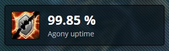

# Statistic Boxes

Statistic boxes show off module details independently of suggestions. This document will go over some code templates and current examples of how to display information in different styles of boxes.

**Topics**
- [Box layout & order](#box-layout--order)
- [Imports used](#imports-used)

**Types of statistic boxes**
- [Basic](#statisticbox)
  - [Multiple icons in a basic box](#multiple-listing)
  - [Downtime's styled footer bar](#downtimes-styled-footer-bar)
- [Small](#smallstatisticbox)
- [List (Netherlight Crucible style)](#statisticslistbox)
- [Expandable](#expandablestatisticbox)
- [Click to load](#lazyloadstatisticbox)

## Box layout & order

The statistic boxes are laid out in rows from left to right for three columns at most, then top to bottom as long as there are boxes. 

**NOTE**: Display box height will disrupt the order layout, so sometimes it's confusing and awkward to get an exact box order. If you want certain modules to group together in the box display grid, consider using a combo box instead of many default boxes or grouping similarly sized boxes together.
** you can also fudge it within a statistic a la https://github.com/WoWAnalyzer/WoWAnalyzer/blob/master/src/Parser/Paladin/Holy/Modules/PaladinCore/CastBehavior.js

Typically two STATISTIC_ORDER values are used in spec statistic boxes. `CORE` is for base spec abilities, resources, and core spec procs; `OPTIONAL` is used for sometimes-things like talents or minor constants like relics and artifact traits. In detail, the [STATISTIC_ORDER](https://github.com/WoWAnalyzer/WoWAnalyzer/blob/master/src/Main/STATISTIC_ORDER.js) uses this ordering, first > last: `CORE` > `DEFAULT` > `OPTIONAL` > `UNIMPORTANT`.

## Imports used

```javascript
// icons
import SpellIcon from 'common/SpellIcon';

// text/number formatting
import { formatPercentage } from 'common/format';

// statistic boxes + order
import StatisticBox, { STATISTIC_ORDER } from 'Main/StatisticBox';
```

## StatisticBox

StatisticBox is the default and basic statistic box that you will see in the [getting started module documentation](https://github.com/poneria/WoWAnalyzer/blob/doc-statbox/docs/a-new-module.md). 

Box description | Image
----------------|---------
Simple DoT uptime box | 

**Code**

```javascript
// Simple DoT uptime box (Agony Uptime)

  statistic() {
    const agonyUptime = this.enemies.getBuffUptime(SPELLS.AGONY.id) / this.owner.fightDuration;
    return (
      <StatisticBox
        icon={<SpellIcon id={SPELLS.AGONY.id} />}
        value={`${formatPercentage(agonyUptime)} %`}
        label="Agony uptime"
      />
    );
  }

  statisticOrder = STATISTIC_ORDER.CORE(3);
```

Despite being the basic box, there are a few cool display options you can manage with StatisticBox.

### Multiple listing

You can add multiple icons or text rows within a StatisticBox, if you want to show different parts of a module. Horizontal grouping is cleaner, but tends to work with only a single counter beside each icon. 

- (horiz) https://github.com/WoWAnalyzer/WoWAnalyzer/blob/master/src/Parser/Hunter/BeastMastery/Modules/Spells/DireBeast/DireBeast.js
- (vertical) https://github.com/WoWAnalyzer/WoWAnalyzer/blob/master/src/Parser/Mage/Frost/Modules/Features/WintersChill.js
- (vertical) https://github.com/WoWAnalyzer/WoWAnalyzer/blob/master/src/Parser/Shaman/Elemental/Modules/Features/Overload.js

### Downtime's styled footer bar
- https://github.com/WoWAnalyzer/WoWAnalyzer/blob/master/src/Parser/Monk/Mistweaver/Modules/Spells/UpliftingTrance.js

## SmallStatisticBox

This is the stat box that contains a one-liner of text. 

Concordance
Tyr's Deliverance - https://github.com/WoWAnalyzer/WoWAnalyzer/blob/master/src/Parser/Paladin/Holy/Modules/Features/TyrsDeliverance.js

## StatisticsListBox

This is the statistic box that looks like a list of SmallStatisticBoxes one-liners but in one box. The general example is Netherlight Crucible traits and the Relic traits in some class-specs. However, this box type isn't restricted to artifact traits; in fact, you can use it to make pie chart statistics.

Dimensional Rift - https://github.com/WoWAnalyzer/WoWAnalyzer/blob/master/src/Parser/Warlock/Destruction/Modules/Features/DimensionalRift.js

Pie charts
- https://github.com/WoWAnalyzer/WoWAnalyzer/blob/master/src/Parser/Hunter/Marksmanship/Modules/Features/VulnerableApplications.js
- https://github.com/WoWAnalyzer/WoWAnalyzer/blob/master/src/Parser/Monk/Mistweaver/Modules/Spells/ThunderFocusTea.js
- https://github.com/WoWAnalyzer/WoWAnalyzer/blob/master/src/Parser/Paladin/Holy/Modules/PaladinCore/CastBehavior.js

## ExpandableStatisticBox

Some statistic boxes have a big red button to expand. Do note that the expansion doesn't shove the rest of the column's boxes down the page, but overlaps them. The box has a tinted background, but depending on the box below, the overlapping graphics may or may not cause reading issues.

- Flourish https://github.com/WoWAnalyzer/WoWAnalyzer/blob/master/src/Parser/Druid/Restoration/Modules/Talents/Flourish.js
- Evangelism https://github.com/WoWAnalyzer/WoWAnalyzer/blob/master/src/Parser/Priest/Discipline/Modules/Spells/Evangelism.js
- https://github.com/WoWAnalyzer/WoWAnalyzer/blob/master/src/Parser/Priest/Holy/Modules/PriestCore/MasteryBreakdown.js

## LazyLoadStatisticBox

If you need a statistic to wait to load until asked for, you can do it with a LazyLoad box. When you click the button, the statistic loads, instead of the normal loading with the page.

- https://github.com/WoWAnalyzer/WoWAnalyzer/blob/master/src/Parser/Druid/Restoration/Modules/Features/Ironbark.js
- https://github.com/WoWAnalyzer/WoWAnalyzer/blob/master/src/Parser/Priest/Discipline/Modules/Features/PowerWordBarrier.js
- https://github.com/WoWAnalyzer/WoWAnalyzer/blob/master/src/Parser/Priest/Discipline/Modules/Features/LeniencesReward.js
